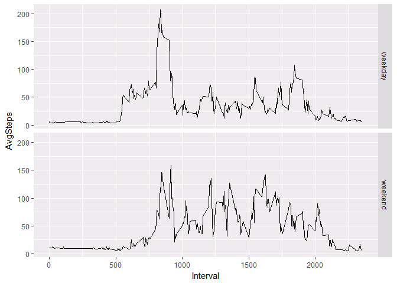

The variables included in this dataset are:
-------------------------------------------

-steps: Number of steps taking in a 5-minute interval (missing values
are coded as ) -date: The date on which the measurement was taken in
YYYY-MM-DD format -interval: Identifier for the 5-minute interval in
which measurement was taken

The dataset is stored in a comma-separated-value (CSV) file and there
are a total of 17,568 observations in this dataset.

Requirements:
-------------

1.  Code for reading in the dataset and/or processing the data
2.  Histogram of the total number of steps taken each day
3.  Mean and median number of steps taken each day
4.  Time series plot of the average number of steps taken
5.  The 5-minute interval that, on average, contains the maximum number
    of steps
6.  Code to describe and show a strategy for imputing missing data
7.  Histogram of the total number of steps taken each day after missing
    values are imputed
8.  Panel plot comparing the average number of steps taken per 5-minute
    interval across weekdays and weekends
9.  All of the R code needed to reproduce the results (numbers,
    plots, etc.) in the report

### 1. Code for reading in the dataset and/or processing the data

    setwd("C:\\Users\\tkondi\\Desktop\\DataScientist\\ReproducibleResearch")
    activity.monitoring <-  read.table("activity.csv",sep=",",header = TRUE)

### 2. Histogram of the total number of steps taken each day

    tday <- tapply(activity.monitoring$steps,activity.monitoring$date,sum)
    df.tday <- data.frame(Date=names(tday),Steps=tday)
    stepsByDate <- aggregate(activity.monitoring$steps,list(activity.monitoring$date),sum)
    names(stepsByDate) <- c("Date","Steps")
    hist(df.tday$Steps)

### 3. What is mean total number of steps taken per day

    mean <- mean(stepsByDate$Steps,na.rm = TRUE)
    median <- median(stepsByDate$Steps, na.rm = TRUE)
    paste("Mean:",round(mean,2),"-","Median:",median,sep=" ")

    ## [1] "Mean: 10766.19 - Median: 10765"

### 4. Time series plot of the average number of steps taken

    meanStepsByInterval <-  aggregate(activity.monitoring$steps,list(activity.monitoring$interval),mean,na.rm = TRUE)
    names(meanStepsByInterval) <- c("Interval", "Steps")
    with(meanStepsByInterval, plot(Interval,Steps,type="l"))        

    #ggplot(activity.monitoring, aes(x=interval, y=steps), na.rm = TRUE )  + stat_summary(fun.y="mean",,geom="bar")

### 5. The 5-minute interval that, on average, contains the maximum number of steps

    meanStepsByInterval[meanStepsByInterval$Steps==max(meanStepsByInterval$Steps),]

    ##     Interval    Steps
    ## 104      835 206.1698

### 6. Code to describe and show a strategy for imputing missing data

Imputing missing values Note that there are a number of days/intervals
where there are missing values (coded as ). The presence of missing days
may introduce bias into some calculations or summaries of the data.

#### Calculate and report the total number of missing values in the dataset (i.e. the total number of rows with s)

    paste("Missing values are",nrow(activity.monitoring[is.na(activity.monitoring$steps),]),"of",nrow(activity.monitoring),"total rows.", round(nrow(activity.monitoring[is.na(activity.monitoring$steps),])/nrow(activity.monitoring)*100,2),"%",sep=" ")

    ## [1] "Missing values are 2304 of 17568 total rows. 13.11 %"

#### Devise a strategy for filling in all of the missing values in the dataset. The strategy does not need to be sophisticated. For example, you could use the mean/median for that day, or the mean for that 5-minute interval, etc.

For the porpuse of the assignment for missing value will use the means
of the intervals as using means of interval the intevals means are
preserved. For better imputation I've found that multiple imputation
techincs can be used as described in following
article:<https://www.analyticsvidhya.com/blog/2016/03/tutorial-powerful-packages-imputing-missing-values/>

    #code for mearging each interval with corresponding mean value
    intervalByMean <- merge(activity.monitoring,meanStepsByInterval, by.x = "interval", by.y = "Interval" )

#### Create a new dataset that is equal to the original dataset but with the missing data filled in.

    dsNoNAs <- activity.monitoring
    #assigning mean step to each step
    dsNoNAs$steps[is.na(dsNoNAs$steps)]<-intervalByMean$Steps[is.na(intervalByMean$steps)] 

### 7. Histogram of the total number of steps taken each day after missing values are imputed

    tday <- tapply(dsNoNAs$steps,dsNoNAs$date,sum)
    df.tday <- data.frame(Date=names(tday),Steps=tday)
    stepsByDate <- aggregate(dsNoNAs$steps,list(dsNoNAs$date),sum)
    names(stepsByDate) <- c("Date","Steps")
    hist(df.tday$Steps)

Do these values differ from the estimates from the first part of the
assignment? What is the impact of imputing missing data on the estimates
of the total daily number of steps?

    mean <- mean(stepsByDate$Steps,na.rm = TRUE)
    median <- median(stepsByDate$Steps, na.rm = TRUE)
    paste("Mean:",round(mean,2),"-","Median:",median,sep=" ")

    ## [1] "Mean: 10766.19 - Median: 11015"

From before results the mean as expected dosen't change as the mean of
steps has been used but changes the meadina of population

### 8. Panel plot comparing the average number of steps taken per 5-minute interval across weekdays and weekends

#### Create a new factor variable in the dataset with two levels - "weekday" and "weekend" indicating whether a given date is a weekday or weekend day.

    dsNoNAs[,"weekday"] <-ifelse(
                        weekdays(as.Date(dsNoNAs$date))=="domenica" |
                        weekdays(as.Date(dsNoNAs$date)) == "sabato",
                        "weekend","weekday"
                          )

#### Make a panel plot containing a time series plot (i.e. type = "l") of the 5-minute interval (x-axis) and the average number of steps taken, averaged across all weekday days or weekend days (y-axis). See the README file in the GitHub repository to see an example of what this plot should look like using simulated data.

      avgStepsByDate <- aggregate(dsNoNAs$steps,list(dsNoNAs$interval,dsNoNAs$weekday),mean)
      names(avgStepsByDate) <- c("Interval","Weekday","AvgSteps")
      library(ggplot2)

    ## Warning: package 'ggplot2' was built under R version 3.4.3

      ggplot(avgStepsByDate,aes(Interval,AvgSteps)) + facet_grid(factor(Weekday)~. ) +   geom_line()

### 9. All of the R code needed to reproduce the results (numbers, plots, etc.) in the report

All has been provided.
